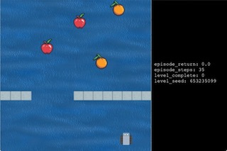

## CS182 Final Project, Spring 2020 
# Train a Fruitbot Agent that Learns Fast and Generalizes Well



## Setup on Google Colab Platform
Open a new kernel, connect to GPU runtime, and run:
```
!pip install https://github.com/openai/baselines/archive/9ee399f5b20cd70ac0a871927a6cf043b478193f.zip
!pip install tensorflow==1.15.0 mpi4py==3.0.3 gym==0.15.4 
!git clone https://github.com/openai/procgen.git
!git clone https://github.com/MandiZhao/train-procgen.git
%cd procgen
!pip install -e .
%cd ..
%cd train-procgen
!pip install -e .
```
Then all scripts can be run from here. 


## Setup on GPU-accelerated machines:
Need to export variables:
first confirm `/usr/local/cuda-10.0/lib64` exists (or other versions of cuda, e.g. cuda-5.0), then
```
export LD_LIBRARY_PATH=/usr/local/cuda-10.0/lib64:/usr/local/cuda-10.0/lib
```
if the desired GPU has index 0, do: 
```
export CUDA_VISIBLE_DEVICES=0
```

As a reference, output from current conda env that uses GPU:
```
(train-procgen)$ echo $LD_LIBRARY_PATH
/home/mandi/.local/bin:/home/mandi/bin:/home/mandi/miniconda3/envs/train-procgen/bin:/home/mandi/miniconda3/condabin:/usr/local/sbin:/usr/local/bin:/usr/sbin:/ussr/bin:/sbin:/bin:/usr/games:/usr/local/games:/snap/bin:/home/mandi/bin:/home/mandi/bin:/home/mandi/lib:/usr/local/cuda-10.0/lib64:/usr/local/cuda-10.0/lib
(train-procgen) $ echo $CUDA_VISIBLE_DEVICES 
0
```

## Example command-line usage 
1. To run a training experiments with 50 avaliable levels for 1M steps and log every 30 steps, use cross-cut method for input processing on top of the baseline PPO algorithm, and saved the model with idx 1:
```
$ conda activate train-procgen
$(train-procgen) python train_procgen/train_crop.py -id 1 --use "cross" --num_levels 50 --total_tsteps 1000000 \
--log_interval 30

## If you want to use taskset to limit CPU usage, say only use CPU index 0-5, do
## taskset -c 0-5 python train_procgen/train_recenter.py --nupdates 0 -id 0
## same for commands below
```
2. To load a partially trained random-crop agent at index 4, continue training it for 2M steps, and save at idx 5:
```
$(train-procgen) python train_procgen/train_crop.py -id 5 --load_id 4 --use "randcrop" --num_levels 50 --total_tsteps 2000000 
```

3. To test a trained random-random-cut agent at index 3 on a set of {100, 1000, 2000, ..., 95000} level intervals:
(it's easier to put these blocks of commands in a bash .sh file and run from command line)

```
LOAD=3
USE="randcuts"
taskset -c 0-20 python train_procgen/test_select.py --start_level 100 -id 0 --load_id ${LOAD} --use ${USE}
taskset -c 0-20 python train_procgen/test_select.py --start_level 1000 -id 1 --load_id ${LOAD} --use ${USE}
taskset -c 0-20 python train_procgen/test_select.py --start_level 5000 -id 2 --load_id ${LOAD} --use ${USE}
taskset -c 0-20 python train_procgen/test_select.py --start_level 10000 -id 3 --load_id ${LOAD} --use ${USE}
taskset -c 0-20 python train_procgen/test_select.py --start_level 20000 -id 4 --load_id ${LOAD} --use ${USE}
taskset -c 0-20 python train_procgen/test_select.py --start_level 30000 -id 5 --load_id ${LOAD} --use ${USE}
taskset -c 0-20 python train_procgen/test_select.py --start_level 40000 -id 6 --load_id ${LOAD} --use ${USE}
taskset -c 0-20 python train_procgen/test_select.py --start_level 50000 -id 7 --load_id ${LOAD} --use ${USE}
taskset -c 0-20 python train_procgen/test_select.py --start_level 60000 -id 8 --load_id ${LOAD} --use ${USE}
taskset -c 0-20 python train_procgen/test_select.py --start_level 70000 -id 9 --load_id ${LOAD} --use ${USE}
taskset -c 0-20 python train_procgen/test_select.py --start_level 80000 -id 10 --load_id ${LOAD} --use ${USE}
taskset -c 0-20 python train_procgen/test_select.py --start_level 90000 -id 11 --load_id ${LOAD} --use ${USE}
taskset -c 0-20 python train_procgen/test_select.py --start_level 95000 -id 12 --load_id ${LOAD} --use ${USE}

```


Original train-procgen README:

**Status:** Archive (code is provided as-is, no updates expected)

### Leveraging Procedural Generation to Benchmark Reinforcement Learning

##### [[Blog Post]](https://openai.com/blog/procgen-benchmark/) [[Paper]](https://arxiv.org/abs/1912.01588)

This is code for training agents for some of the experiments in [Leveraging Procedural Generation to Benchmark Reinforcement Learning](https://cdn.openai.com/procgen.pdf) [(citation)](#citation).  The code for the environments is in the [Procgen Benchmark](https://github.com/openai/procgen) repo.

Supported platforms:

- macOS 10.14 (Mojave)
- Ubuntu 16.04

Supported Pythons:

- 3.7 64-bit

## Install

You can get miniconda from https://docs.conda.io/en/latest/miniconda.html if you don't have it, or install the dependencies from [`environment.yml`](environment.yml) manually.

```
git clone https://github.com/openai/train-procgen.git
conda env update --name train-procgen --file train-procgen/environment.yml
conda activate train-procgen
pip install https://github.com/openai/baselines/archive/9ee399f5b20cd70ac0a871927a6cf043b478193f.zip
pip install -e train-procgen
```

# Citation

Please cite using the following bibtex entry:

```
@article{cobbe2019procgen,
  title={Leveraging Procedural Generation to Benchmark Reinforcement Learning},
  author={Cobbe, Karl and Hesse, Christopher and Hilton, Jacob and Schulman, John},
  journal={arXiv preprint arXiv:1912.01588},
  year={2019}
}
```
